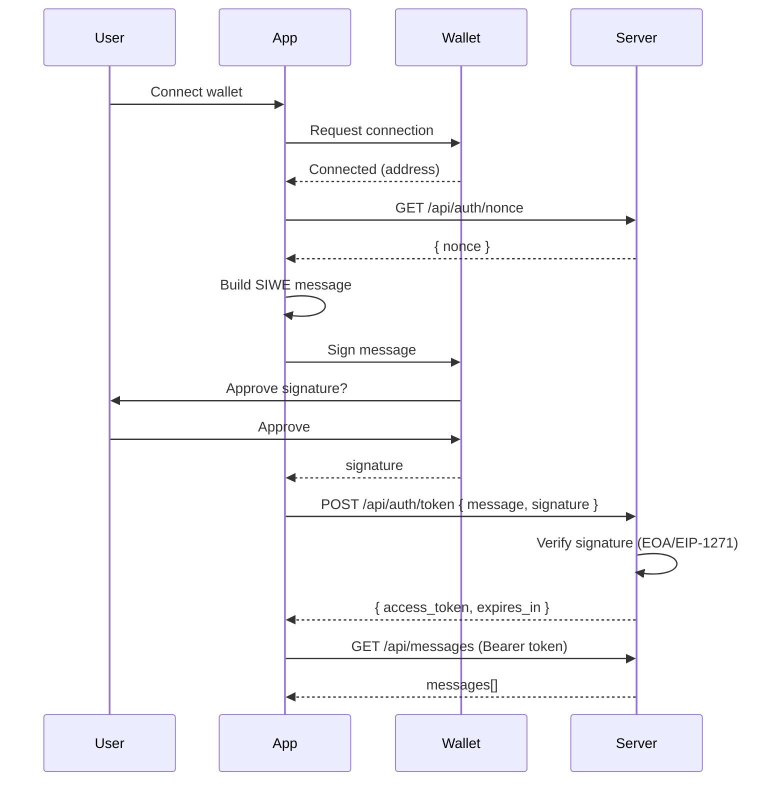
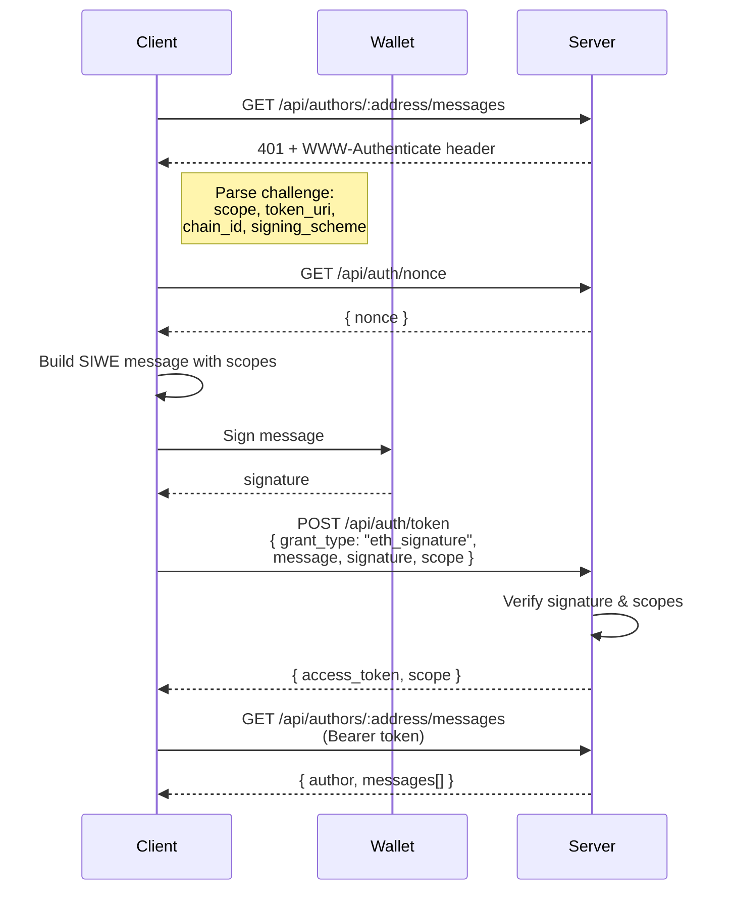

# Private Data Repo

A web app for storing personal messages with Ethereum wallet authentication using Sign-In with Ethereum (SIWE).

## Features

- **Ethereum Authentication**: Sign in with your Ethereum wallet using SIWE (EIP-4361)
- **Data Ownership**: Messages are tied to your Ethereum address - only you can edit/delete your own messages
- **Smart Contract Wallet Support**: EIP-1271 signature verification for Safe, Argent, etc.
- **Persistent Storage**: SQLite database with Railway volume support

## Tech Stack

**Frontend**

- React + Vite
- wagmi/viem for Ethereum interactions
- TanStack Query for async state management

**Backend**

- Bun runtime
- Hono web framework
- SQLite (bun:sqlite)
- jose for JWT handling

## Architecture

```
┌─────────────────────────────────────────────────────────────┐
│                        Frontend                             │
│  ┌─────────────┐  ┌─────────────┐  ┌─────────────────────┐  │
│  │   wagmi     │  │  React      │  │  TanStack Query     │  │
│  │   (wallet)  │  │  (UI)       │  │  (state)            │  │
│  └─────────────┘  └─────────────┘  └─────────────────────┘  │
└─────────────────────────────────────────────────────────────┘
                            │
                            ▼
┌─────────────────────────────────────────────────────────────┐
│                     Hono API Server                         │
│  ┌─────────────┐  ┌─────────────┐  ┌─────────────────────┐  │
│  │  Auth       │  │  Messages   │  │  Vite Dev Server    │  │
│  │  /api/auth  │  │  /api/...   │  │  (dev only)         │  │
│  └─────────────┘  └─────────────┘  └─────────────────────┘  │
└─────────────────────────────────────────────────────────────┘
                            │
                            ▼
┌─────────────────────────────────────────────────────────────┐
│                        SQLite                               │
│  ┌─────────────┐  ┌─────────────┐                           │
│  │  messages   │  │  nonces     │                           │
│  └─────────────┘  └─────────────┘                           │
└─────────────────────────────────────────────────────────────┘
```

## Authentication Flow



1. User connects wallet (MetaMask, etc.)
2. App switches to Ethereum mainnet
3. App fetches a nonce from `/api/auth/nonce`
4. App builds a SIWE message and requests wallet signature
5. App sends message + signature to `/api/auth/token`
6. Server verifies signature using `viem.verifyMessage()` (supports EOA + EIP-1271)
7. Server issues a JWT access token (1 hour expiry)
8. Frontend includes token in `Authorization: Bearer <token>` header for API requests

## Discoverable OAuth Flow (EIP-4361)

For server-to-server API access, the `/api/authors/:address/messages` endpoint implements discoverable OAuth per the draft specification:



1. Client requests the endpoint without authentication
2. Server responds with `401 Unauthorized` and `WWW-Authenticate` header:
   ```
   WWW-Authenticate: Bearer, realm="author-messages", scope="messages:read",
     token_uri="https://api.example.com/api/auth/token", chain_id="1", signing_scheme="eip4361"
   ```
3. Client constructs a SIWE message with scopes in `resources` field:
   ```
   Resources:
   - urn:oauth:scope:messages:read
   ```
4. Client signs the message and exchanges for a token:
   ```json
   POST /api/auth/token
   {
     "grant_type": "eth_signature",
     "message": "<SIWE message>",
     "signature": "0x...",
     "scope": "messages:read"
   }
   ```
5. Server returns an OAuth-compatible token response:
   ```json
   {
     "access_token": "<jwt>",
     "token_type": "Bearer",
     "expires_in": 3600,
     "scope": "messages:read"
   }
   ```
6. Client retries with `Authorization: Bearer <token>`

## API Endpoints

### Public

- `GET /api/auth/nonce` - Get a fresh nonce for SIWE
- `POST /api/auth/token` - Exchange signed SIWE message for JWT (supports `eth_signature` grant type)

### Discoverable OAuth (returns WWW-Authenticate challenge)

- `GET /api/authors/:address/messages` - Get messages by author (requires `messages:read` scope)

### Protected (requires Bearer token)

- `GET /api/messages` - List all messages
- `POST /api/messages` - Create a message
- `PUT /api/messages/:id` - Update a message (owner only)
- `DELETE /api/messages/:id` - Delete a message (owner only)

## OAuth Scopes

- `messages:read` - Read messages
- `messages:write` - Create/update/delete messages

## Development

```bash
# Install dependencies
bun install

# Create .env file
echo "JWT_SECRET=$(openssl rand -base64 32)" > .env

# Start dev server
bun run dev
```

Open http://localhost:3000

## Production

```bash
# Build frontend
bun run build

# Start production server
NODE_ENV=production JWT_SECRET=your-secret DATA_DIR=/app/data bun server/index.ts
```

## Railway Deployment

1. Connect your GitHub repo to Railway
2. Add environment variables:
   - `JWT_SECRET` - Generate with `openssl rand -base64 32`
3. Add a persistent volume mounted at `/app/data`
4. Deploy

The app uses `nixpacks.toml` for build configuration and `railway.json` for deployment settings.

## Related

- [Private Data Client](https://github.com/stephancill/eth-private-data-repo-client) - Sample client demonstrating the discoverable OAuth flow
- [EIP-4361: Sign-In with Ethereum](https://eips.ethereum.org/EIPS/eip-4361)
